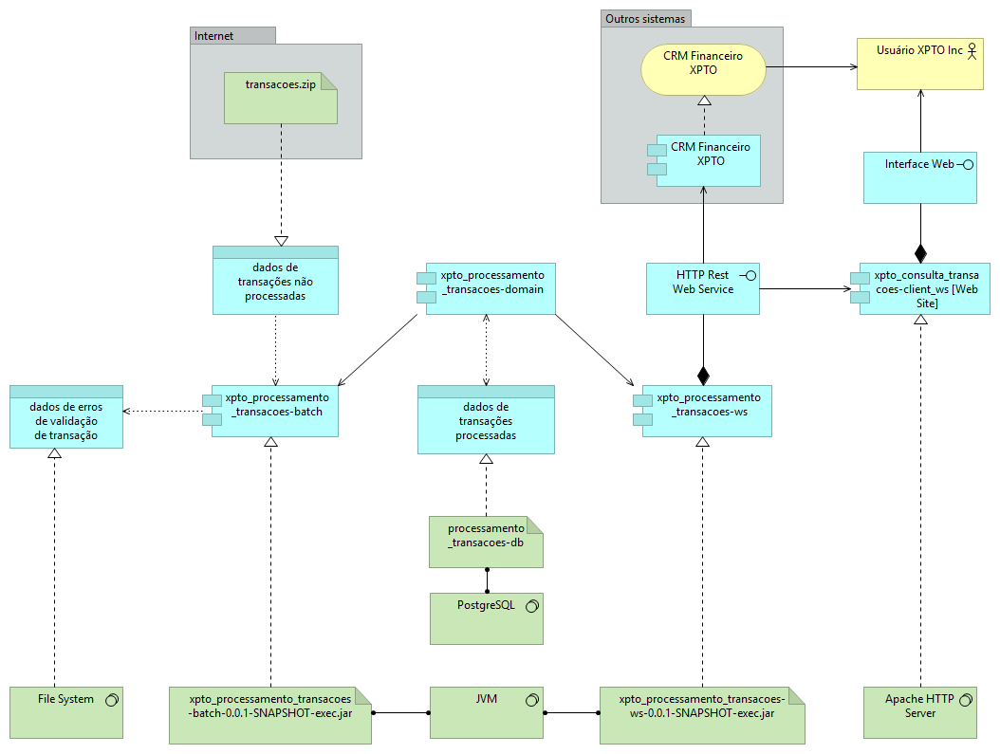
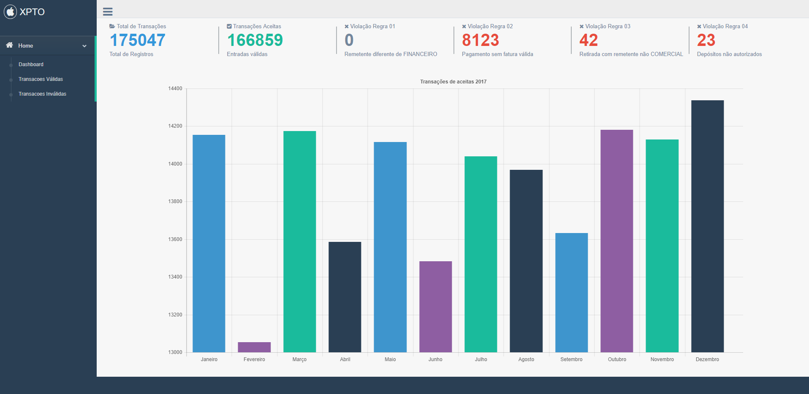
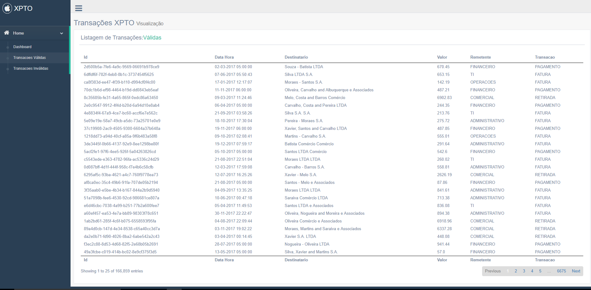

# Desafio Hackathon 2018 - Equipe Code Surfers
# Projeto xpto-processamento_transacoes


## Introdução

Este projeto foi desenvolvido com a intenção de atender as especificações previstas na página do <a href="https://hackathon.dtplabs.in/snippets/1">Desafio - Hackathon 2018</a>, que, em síntese, dizem respeito ao seguinte:

1) Download e processamento de um arquivo texto com registros financeiros, de acordo com regras pré-estabelecidas, a fim de validar os registros constantes neste arquivo.

2) Persistência dos registros de transações processadas em base de dados e gravação de registros invalidados em log.

3) Disponibilização de API para consulta à transações processadas e válidadas.

Além de obedecer as especificações anteriores, este projeto contemplou o desenvolvimento de um componente com interface gráfica web para consumir e exibir dados das transações processadas disponibilizadas pela API.


## Visão Geral da Arquitetura



Como se pode observar no diagrama apresentado acima, a solução ```xpto-processamento_transacoes```, é composta por 4 componentes principais:

- ```xpto_processamento_transacoes-batch```: Este componente é um batch desenvolvido com Spring Batch + Spring Boot e é composto por 4 Steps:

    1) Download e descompactação do arquivo com dados de transações não processadas;

    2) Carga de registros de transações processadas em uma base de dados PostgreSQL;

    3) Aplicação das regras de validação dos registros e persistência na base de dados;

    4) Geração de arquivo de log de erros de validação em transações;

    É entregue através do artefato executável <a href="artefatos_executaveis/xpto_processamento_transacoes-batch-0.0.1-SNAPSHOT-exec.jar">xpto_processamento_transacoes-batch-0.0.1-SNAPSHOT-exec.jar</a>.

- ```xpto_processamento_transacoes-domain```: Este componente contém as entidades JPA e os repositórios usados para persistência de dados e consulta. É incluido como dependência dos componentes ```xpto_processamento_transacoes-batch``` e ```xpto_processamento_transacoes-ws``` no build com Maven.

- ```xpto_processamento_transacoes-ws```: Este componente é um web service rest desenvolvido com Spring MVC + Spring Boot e disponibiliza API para consulta à transações processadas e validadas pelo componente ```xpto_processamento_transacoes-batch```. É entregue através do artefato executável <a href="artefatos_executaveis/xpto_processamento_transacoes-ws-0.0.1-SNAPSHOT-exec.jar">xpto_processamento_transacoes-ws-0.0.1-SNAPSHOT-exec.jar</a>, o qual, ao ser executado localmente, disponibiliza os seguintes endpoints:

    - <a href="http://localhost:8080/transacoes/">http://localhost:8080/transacoes/</a>
    - <a href="http://localhost:8080/transacoes/format/datatables?draw=0">http://localhost:8080/transacoes/format/datatables?draw=0</a>
    - <a href="http://localhost:8080/transacoes/quantidade/mes">http://localhost:8080/transacoes/quantidade/mes</a>
    - <a href="http://localhost:8080/transacoes/classificacao/validacao">http://localhost:8080/transacoes/classificacao/validacao</a>

- ```xpto_consulta_transacoes-client_ws [Web Site]```: Este componente é uma interface gráfica web desenvolvida com HTML 5, CSS e JS para permitir visualização de dados das transações processadas disponibilizadas pela API


## Tecnologias Utilizadas

> Spring Boot

> Spring Batch

> Spring Core (Spring MVC e Spring Data)

> JPA

> Maven

> HTML5

> Javascript

> Gentelella Theme
 
> Bower

> Apache Launcher

> PostgreSQL 10.5


## Facilidade para Auditoria

Este projeto contém um módulo web para realizar consultas. Construído em cima do framework Gentelella.

Construímos um painel (Dashboard) interativo que apresenta um monitor de situação de acordo com as classificações das transações, separando por suas regras de validação.

Um gráfico dinâmico que apresenta a distribuição de transações ao longo do ano.


    
Para facilitar a auditoria criamos duas telas que apresentam a listagem de transações que foram realizadas com sucesso e as que foram rejeitas.




## Instruções de Desenvolvimento

### Ferramentas e Softwares
 - Java 8 - Baixar e Instalar a versão 1.8 do JDK da Oracle, na seção Oracle Java Archive; 
 - Maven - Efetuar o download de uma versão do Maven compatível com Java 1.8 (a utilizada foi 3.2.3);
 - Spring Tool Suite - É indicado a utilização do STS pela boa integração com as tecnologias utilizadas;
 - GIT - Versão mais recente.
 - Instalação do Node, Node Package Manager (npm) e Bower;
 - Instalação do PostgreSQL

### Setup do Ambiente
 - Efetuar o clone do projeto para o seu workspace - https://hackathon.dtplabs.in/desafio/code-surfers/xpto-processamento_transacoes.git
 - Acessar a raiz do modulo parent <b>xpto_processamento_transacoes-parent</b> do projeto e executar os comandos ```mvn package```;
 - Após configurado o bower, você deve ir na raiz do projeto <b>xpto_consulta_transacoes-client_ws</b> e executar o ```bower install``` para baixar as dependências do painel web.


## Procedimentos para Deploy e Implantação

### Certificar-se de ter os seguintes softwares estão instalados e configurados:

- PostgreSQL v10.5 - porta 5432 - usuario: postgres - senha: 123
- JRE 8 - variáveis JAVA_HOME e CLASSPATH e PATH configuradas


### Baixar os seguintes artefatos do repositório: 

- <a href="artefatos_executaveis/xpto_processamento_transacoes-batch-0.0.1-SNAPSHOT-exec.jar">xpto_processamento_transacoes-batch-0.0.1-SNAPSHOT-exec.jar</a>

- <a href="artefatos_executaveis/xpto_processamento_transacoes-ws-0.0.1-SNAPSHOT-exec.jar">xpto_processamento_transacoes-ws-0.0.1-SNAPSHOT-exec.jar</a>

- <a href="artefatos_executaveis/Apache24.zip">Apache24.zip</a>

### Executar o jar do batch: 

- ```java -jar xpto_processamento_transacoes-batch-0.0.1-SNAPSHOT-exec.jar ano=2018```

### Verificar arquivo criado dentro da pasta ```log```, criada no diretório em que o .jar do batch foi executado:

### Executar o jar do web service: 

- ```java -jar xpto_processamento_transacoes-ws-0.0.1-SNAPSHOT-exec.jar```

### Verificar o web service em execução acessando os seguintes endpoints:
    
- <a href="http://localhost:8080/transacoes/">http://localhost:8080/transacoes/</a> - Retorna as transações validadas (por padrão 100 transações). Pode receber os parâmetros inteiros "page" (default 0) e "limit" (default 100), indicando, respectivamente, a página e o número de registros a serem buscados/retornados.

- <a href="http://localhost:8080/transacoes/format/datatables?draw=0">http://localhost:8080/transacoes/format/datatables?draw=0</a> - Retorna as transações válidas (parâmetro "validas"="true") ou inválidas (parâmetro "validas"="false"). É usado pelo módulo de interface web e pode receber os parâmetros inteiros "start" (default 0), "validas" (default true), "length" (default 25), "draw" (obrigatório).

- <a href="http://localhost:8080/transacoes/quantidade/mes">http://localhost:8080/transacoes/quantidade/mes</a> - Retorna a quantidade de transações para cada mês de um ano passado como parâmetro. É usado pelo módulo de interface web e ode receber o parâmetro inteiro "ano" (default 2018)

- <a href="http://localhost:8080/transacoes/classificacao/validacao">http://localhost:8080/transacoes/classificacao/validacao</a> - Retorna a quantidade de transações válidas e inválidas por tipo de erro de validação referentes a um ano passado como parâmetro. É usado pelo módulo de interface web e pode receber o parâmetro inteiro "ano" (default 2018).


### Descompactar Apache24.zip no diretório ```C:\``` do Windows (7 ou 10):

- Caminho do Apache deve ser ```C:\Apache24```

### Executar arquivo: 

```C:\Apache24\bin\httpd.exe```

### Verificar aplicação web executando em:

```http://localhost```

