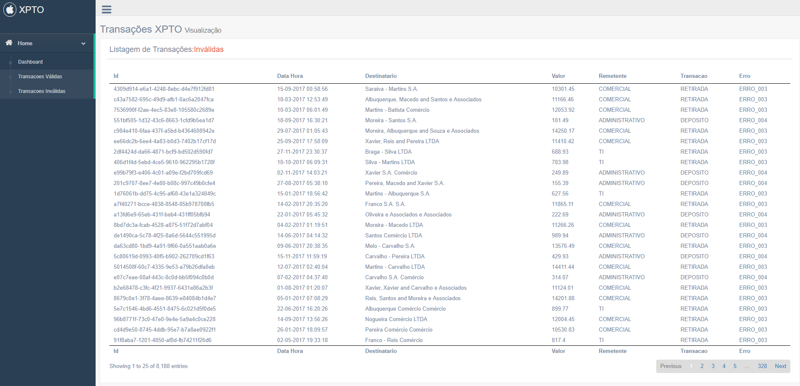

# Desafio Hackathon 2018 - Equipe Code Surfers
# Projeto xpto-processamento_transacoes


## Introdução

Este projeto foi desenvolvido com a intenção de atender as especificações previstas na página do <a href="https://hackathon.dtplabs.in/snippets/1">Desafio - Hackathon 2018</a>, que, em síntese, dizem respeito ao seguinte:

    1. Download e processamento de um arquivo texto com registros financeiros, de acordo com regras pré-estabelecidas, a fim de validar os registros constantes neste arquivo.

    2. Persistência dos registros de transações processadas em base de dados e gravação de registros inválidados em log.

    3. Disponibilização de API para consulta à transações processadas e válidadas.

Além de obedecer as especificações anteriores, este projeto contemplou o desenvolvimento de um componente com interface gráfica web para consumir e exibir dados das transações processadas disponibilizadas pela API.


## Visão Geral da Arquitetura


Como se pode observar no diagrama apresentado acima, a solução ```xpto-processamento_transacoes```, é composta por 4 componentes principais:

- ```xpto_processamento_transacoes-batch```:

- ```xpto_processamento_transacoes-domain```:

- ```xpto_processamento_transacoes-ws```:


## Tecnologias Utilizadas

> Spring Batch

> Spring Boot

> Restful

> HTML5

> Javascript

> Gentelella Theme
 
> Bower

> Apache Launcher

> PostgreSQL 10.5


## Facilidade para Auditoria

Este projeto contém um módulo web para realizar consultas. Construído em cima do framework Gentelella.

Construímos um painel (Dashboard) interativo que apresenta um monitor de situação de acordo com as classificações das transações, separando por suas regras de validação.

Um gráfico dinâmico que apresenta a distribuição de transações ao longo do ano.


    
Para facilitar a auditoria criamos duas telas que apresentam a listagem de transações que foram realizadas com sucesso e as que foram rejeitas.





## Instruções de Desenvolvimento

### Ferramentas e Softwares
 - Java 8 - Baixar e Instalar a versão 1.8 do JDK da Oracle, na seção Oracle Java Archive; 
 - Maven - Efetuar o download de uma versão do Maven compatível com Java 1.8 (a utilizada foi 3.2.3);
 - Spring Tool Suite - É indicado a utilização do STS pela boa integração com as tecnologias utilizadas;
 - GIT - Versão mais recente.
 - Instalação do Node, Node Package Manager (npm) e Bower;
 - Instalação do PostgreSQL

### Setup do Ambiente
 - Efetuar o clone do projeto para o seu workspace - https://hackathon.dtplabs.in/desafio/code-surfers/xpto-processamento_transacoes.git
 - Acessar a raiz do modulo parent <b>xpto_processamento_transacoes-parent</b> do projeto e executar os comandos ```mvn package```;
 - Após configurado o bower, você deve ir na raiz do projeto <b>xpto_consulta_transacoes-client_ws</b> e executar o ```bower install``` para baixar as dependências do painel web.

## Procedimentos para Deploy e Implantação

> Listar os procedimentos necessários para deploy e implantação do produto em ambiente produtivo 


